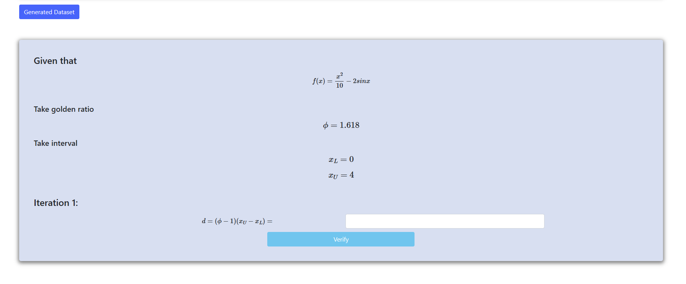
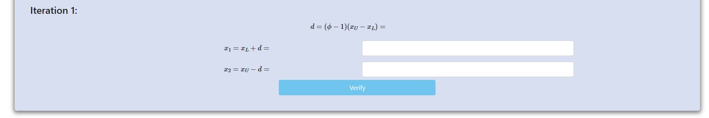
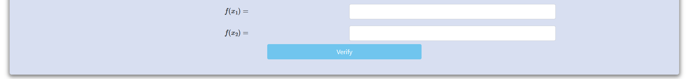
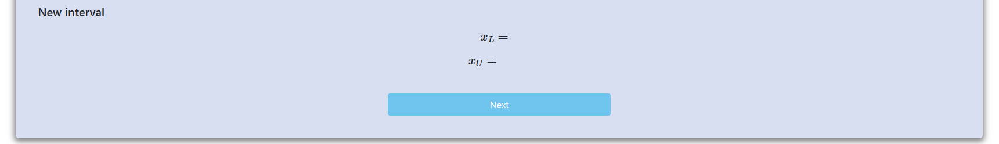
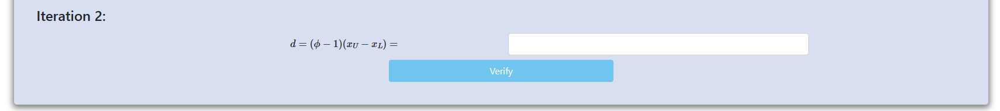

<h2>Procedure:</h2>

<h3>Step 1 : Click on "Next".</h3>

    

<h3>Step 2 : Calculate d</h3>

    

<h3>Step 3 : Calculate x1 and x2</h3>

    

<h3>Step 4 : Calculate f(x1) and f(x2)</h3>

    

<h3>Step 5 : Updated value of xL and xU for next iteration.</h3>

    

<h3>Step 6 : Calculate d</h3>

    

<h3>Step 7 : Calculate x1 and x2</h3>

    

<h3>Step 8 : Calculate f(x1) and f(x2)</h3>

    

<h3>Step 9 : Updated value of xL and xU for next iteration.</h3>

    

